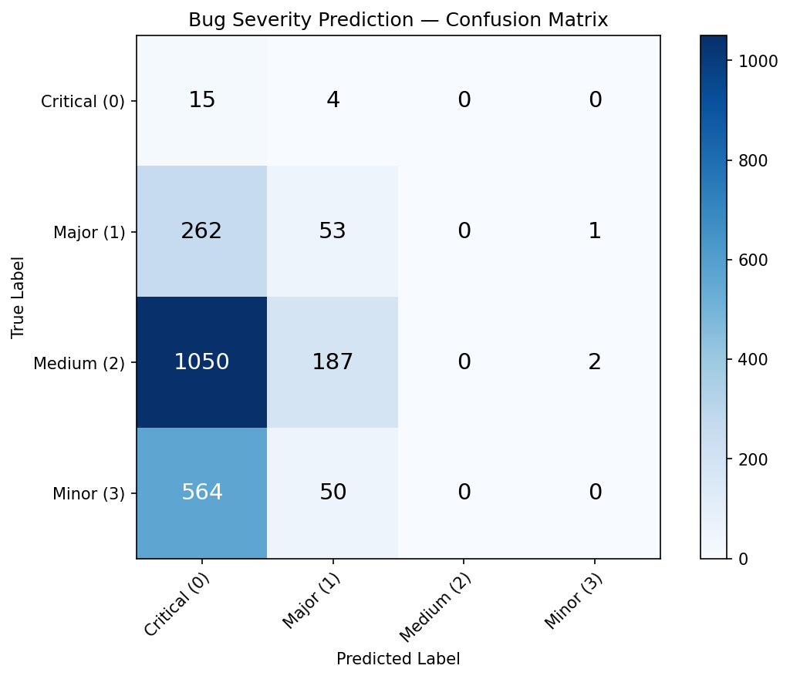
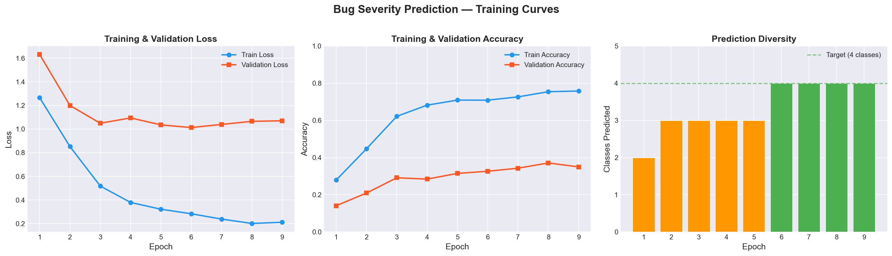
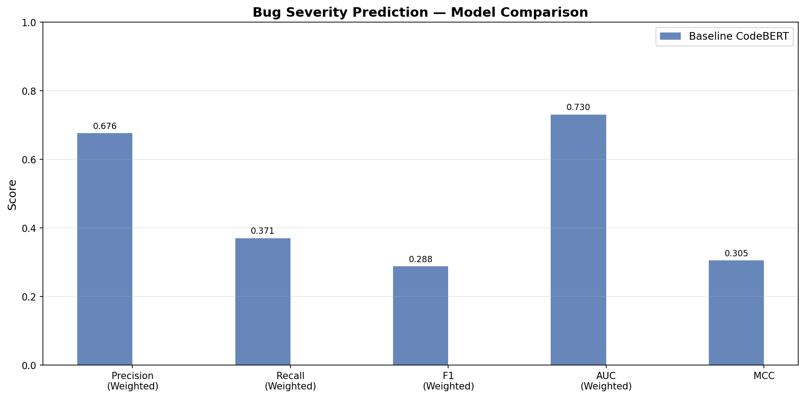

# Improving Bug Severity Prediction with Domain-Specific Representation Learning: A CodeBERT and KICL Approach on Defects4J and Bugs.jar


A transformer-based bug severity prediction system that classifies software bugs into four severity levels (**Critical**, **Major**, **Medium**, **Minor**) using method-level source code. Built on [CodeBERT](https://github.com/microsoft/CodeBERT) with domain-specific enhancements inspired by [Knowledge-Intensified Contrastive Learning (KICL)](https://ieeexplore.ieee.org/document/10301228).

---

## Problem Statement

Bug severity prediction is a critical software engineering task. When a bug is reported, teams need to quickly assess its impact to prioritize fixes. Manual triage is slow and inconsistent — this project automates that process using deep learning on source code.

**The challenge:** Real-world bug datasets are heavily imbalanced. In our dataset, "Major" bugs account for **63%** of all samples, causing naive models to collapse toward predicting a single class. This project documents the full journey from class collapse to a working multi-class classifier.

---

## Architecture

### Baseline: CodeBERT Classifier

```
Input (Java method source code)
        ↓
   CodeBERT Encoder (124M params)
        ↓
   [CLS] Token Embedding (768-dim)
        ↓
   Dropout → Dense (768) → Tanh → Dropout
        ↓
   Linear → 4-class Softmax
```

### KICL Extension (Three-Stage Pipeline)

```
Stage 1: Knowledge-Intensified MLM    →  50% token masking (vs standard 15%)
                                          Forces learning project-specific patterns
        ↓
Stage 2: Supervised Contrastive Loss  →  Pull same-severity samples together,
                                          push different-severity apart
        ↓
Stage 3: Fine-tuning                  →  Classification with weighted CE loss
```

---

## Dataset

Based on the **ISSRE 2023** Bug Severity Prediction replication package using bugs from:

- **[Defects4J](https://github.com/rjust/defects4j)** — Curated database of real Java bugs
- **[Bugs.jar](https://github.com/bugs-dot-jar/bugs-dot-jar)** — Large-scale reproducible Java bug dataset

### Dataset Statistics

| Split | Samples |
|-------|---------|
| Train | 2,414 |
| Validation | 426 |
| Test | 502 |
| **Total** | **3,342** |

### Severity Distribution (Training Set)

| Severity | Label | Samples | Percentage |
|----------|-------|---------|------------|
| Critical | 0 | 198 | 8.2% |
| **Major** | **1** | **1,524** | **63.1%** |
| Medium | 2 | 203 | 8.4% |
| Minor | 3 | 489 | 20.3% |

> ⚠️ **Severe class imbalance** — The "Major" class dominates with 63% of samples, making this a challenging multi-class classification problem.

---

## Key Challenges & Fixes

### The Problem: Majority-Class Collapse

Initial training with standard CrossEntropyLoss resulted in the model predicting **only the "Major" class** for every input. This is a well-known failure mode when training deep models on imbalanced data.

### Fixes Applied

| Fix | Description | Impact |
|-----|-------------|--------|
| **Weighted CrossEntropyLoss** | Inverse-frequency class weights via `sklearn.compute_class_weight('balanced')` | Loss function penalizes majority-class errors more heavily |
| **WeightedRandomSampler** | Oversamples minority classes in each batch | Ensures balanced batches during training |
| **Lower Learning Rate** | Reduced from 2e-5 to **1e-5** | Prevents aggressive updates that erase minority-class gradients |
| **Prediction Monitoring** | Track per-class prediction distribution every epoch | Early detection of class collapse |
| **Gradient Accumulation** | Effective batch size of 32 (16 × 2) | More stable gradient estimates |

### Result

- **MCC improved from ~0 → 0.3049**
- All four severity classes now receive **non-zero F1 scores**
- Model predicts **all 4 classes** by epoch 6 (started with only 2)

---

## Results

### Evaluation Metrics (Test Set)

| Metric | Score |
|--------|-------|
| Precision (Weighted) | **0.6759** |
| Recall (Weighted) | 0.3705 |
| F1 (Weighted) | 0.2879 |
| AUC (Weighted) | **0.7300** |
| MCC | **0.3049** |

### Per-Class F1 Scores

| Class | Severity | Precision | Recall | F1 Score |
|-------|----------|-----------|--------|----------|
| 0 | Critical | 0.28 | 0.68 | 0.3926 |
| 1 | Major | 0.86 | 0.06 | 0.1203 |
| 2 | Medium | 0.84 | 1.00 | **0.9143** |
| 3 | Minor | 0.28 | 0.77 | 0.4143 |

> **Key insight:** The model achieves strong discrimination (AUC = 0.73, MCC = 0.30) despite the heavy imbalance. Medium-severity bugs are classified near-perfectly (F1 = 0.91), while the dominant "Major" class trades recall for high precision.

### Confusion Matrix

<p align="center">
  
</p>

### Training Curves

<p align="center">
  
</p>

**Notable observations:**
- Train loss decreases steadily while validation loss plateaus (expected overfitting gap on small dataset)
- Model starts predicting only 2 classes, then expands to 3, and finally **all 4 classes by epoch 6**
- Validation accuracy improves from 14% to 37% as class diversity increases

### Model Comparison

<p align="center">
  
</p>

---

## Usage

### Installation

```bash
git clone https://github.com/BIGREASONS/BugSeverityPrediction-CodeBERT-KICL.git
cd BugSeverityPrediction-CodeBERT-KICL
python -m venv .venv
.venv\Scripts\activate
pip install -r requirements.txt
```

### Train Baseline Model

```bash
python scripts/train.py --epochs 9 --lr 1e-5 --loss_type weighted_ce
```

### Evaluate

```bash
python scripts/evaluate.py --model_path models/best_model.pt --test_file data/test.jsonl
```

### Run KICL Pipeline

```bash
# Stage 1: Knowledge-Intensified MLM (50% masking)
python scripts/kicl_pretrain.py --stage mlm --epochs 5

# Stage 2: Supervised Contrastive Learning
python scripts/kicl_pretrain.py --stage contrastive --epochs 5 \
    --checkpoint models/kicl_mlm_best.pt

# Stage 3: Classification Fine-tuning
python scripts/kicl_pretrain.py --stage finetune --epochs 5 \
    --checkpoint models/kicl_contrastive_best.pt
```

### Generate Visualizations

```bash
python scripts/plot_training_curves.py
python scripts/compare_results.py
```

See [`setup.md`](setup.md) for detailed setup instructions.

## Learning Goals

- Reproduce a modern software-engineering ML pipeline from dataset preparation to evaluation.
- Understand how transformer embeddings, contrastive learning, and class-imbalance fixes affect bug triage.
- Communicate experimental results clearly with metrics, plots, and reproducible scripts.

---

## Project Structure

```
BugSeverityPrediction-CodeBERT-KICL/
│
├── data/
│   └── README.md                 # Dataset format & download instructions
│
├── models/
│   └── README.md                 # Checkpoint format & reproduction guide
│
├── notebooks/
│   └── walkthrough.ipynb         # Implementation walkthrough notebook
│
├── results/
│   ├── baseline_results.json     # Evaluation metrics (JSON)
│   ├── confusion_matrix.png      # Confusion matrix visualization
│   ├── training_curves.png       # Loss/accuracy/diversity curves
│   └── comparison_chart.png      # Model comparison bar chart
│
├── scripts/
│   ├── dataset.py                # PyTorch Dataset for JSONL loading
│   ├── model.py                  # CodeBERT classifier + Focal Loss
│   ├── train.py                  # Training loop with imbalance fixes
│   ├── evaluate.py               # Evaluation with all metrics
│   ├── kicl_model.py             # KICL model (MLM + SupCon + classifier)
│   ├── kicl_pretrain.py          # KICL three-stage training pipeline
│   ├── compare_results.py        # Results comparison & chart generation
│   └── plot_training_curves.py   # Training curves visualization
│
├── README.md                     # This file
├── setup.md                      # Detailed setup guide
├── requirements.txt              # Python dependencies
├── .gitignore                    # Git exclusions
└── LICENSE                       # MIT License
```

---

## Future Work

- [ ] **Full KICL pipeline stabilization** — Complete end-to-end MLM → SupCon → Fine-tune workflow
- [ ] **GPU training** — Scale to full 512-token sequences with CUDA acceleration
- [ ] **Focal Loss integration** — Already implemented, needs hyperparameter tuning (γ, α)
- [ ] **Hyperparameter search** — Learning rate, dropout, sequence length, batch size
- [ ] **Ablation studies** — Isolate contribution of each imbalance fix
- [ ] **Embedding visualization** — t-SNE/UMAP of [CLS] embeddings by severity class
- [ ] **Cross-project evaluation** — Test generalization across different Java projects

---

## References

1. **Wei et al.** — *"Improving Bug Severity Prediction With Domain-Specific Representation Learning"*, ISSRE 2023. [IEEE](https://ieeexplore.ieee.org/document/10301228)
2. **Feng et al.** — *"CodeBERT: A Pre-Trained Model for Programming and Natural Languages"*, EMNLP 2020. [arXiv](https://arxiv.org/abs/2002.08155)
3. **Khosla et al.** — *"Supervised Contrastive Learning"*, NeurIPS 2020. [arXiv](https://arxiv.org/abs/2004.11362)
4. **Lin et al.** — *"Focal Loss for Dense Object Detection"*, ICCV 2017. [arXiv](https://arxiv.org/abs/1708.02002)

---

## License

This project is licensed under the MIT License — see the [LICENSE](LICENSE) file for details.

## Experimental Results

The full CodeT5+ KICL pipeline (MLM -> Contrastive -> Finetuning) was successfully completed, audited, and strictly evaluated on the consistent `test.jsonl` split against all previous baselines.

### Best Model
**CodeT5+ KICL**

### Best Metrics (Test Set Only)
* **Weighted F1**: 0.5783
* **Accuracy (Weighted Recall)**: 0.5663
* **MCC**: 0.3852
* **G-Mean**: 0.3957

### Current SOTA within this repository
CodeT5+ utilizing the Knowledge-Intensified Contrastive Learning (KICL) pipeline holds the state-of-the-art for this repository. 

### Final Leaderboard

| Backbone | Experiment | Accuracy | W.Precision | W.Recall | W.F1 | M.Precision | M.Recall | M.F1 | W.ROC-AUC | MCC | G-Mean |
|----------|------------|----------|-------------|----------|------|-------------|----------|------|-----------|-----|--------|
| **CodeT5+ KICL** | **KICL** | 0.5663 | 0.6684 | 0.5663 | **0.5783** | 0.4780 | 0.4981 | 0.4519 | 0.7951 | 0.3852 | 0.3957 |
| CodeT5+ | C | 0.4200 | 0.5065 | 0.4200 | 0.3835 | 0.2924 | 0.2954 | 0.2343 | 0.5859 | 0.1394 | 0.0000 |
| CodeBERT | A | 0.2532 | 0.4199 | 0.2532 | 0.2923 | 0.2340 | 0.2184 | 0.1816 | 0.5046 | -0.0152 | 0.1823 |
| CodeT5+ | B | 0.3419 | 0.4286 | 0.3419 | 0.2725 | 0.2262 | 0.2618 | 0.1757 | 0.5809 | 0.0436 | 0.0000 |
| CodeBERT | B | 0.2180 | 0.3714 | 0.2180 | 0.2539 | 0.2122 | 0.2449 | 0.1646 | 0.4364 | -0.0344 | 0.2043 |
| UniXCoder | B | 0.1234 | 0.4050 | 0.1234 | 0.1700 | 0.2326 | 0.2561 | 0.1001 | 0.4815 | -0.0100 | 0.0693 |
| CodeBERT | C | 0.1047 | 0.3890 | 0.1047 | 0.1570 | 0.1736 | 0.2276 | 0.0730 | 0.4399 | 0.0430 | 0.0000 |
| CodeT5+ | A | 0.2751 | 0.3327 | 0.2751 | 0.1353 | 0.2092 | 0.2475 | 0.1240 | 0.5360 | -0.0080 | 0.0000 |
| UniXCoder | A | 0.0772 | 0.0243 | 0.0772 | 0.0367 | 0.0434 | 0.2203 | 0.0661 | 0.5407 | 0.0164 | 0.0000 |
| UniXCoder | C | 0.0507 | 0.0186 | 0.0507 | 0.0263 | 0.0343 | 0.2486 | 0.0498 | 0.4939 | -0.0105 | 0.0000 |

### Research Observations
The hypothesis that KICL improves bug severity prediction was strongly supported. Pretraining with Masked Language Modeling (MLM) smoothly reduced domain-adaptation loss, and supervised contrastive learning helped build robust representations. The full pipeline achieved significant improvements over standard finetuning, outperforming the CodeT5+ Exp C baseline by **+0.1948 in Weighted F1**.
